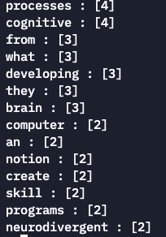

# A simple research tool in Python :: Web-KeyWord-Parser

App Code Link : [GitHub](https://github.com/SidLabs-Online/KeyWords_Parser_Py)

---

# Keywords

‘Keywords’ in today’s world may have different definitions emerging from different perspective of usage. For example people enter keywords into a search engine to find information, while a search engine optimizer would use keywords to tell the search engines about the content of your webpage. Hence we see that there is a huge scope to form new definitions with intelligent use of the keywords logic.

While marketers compete to learn more about keywords, it is important for other domains to explore this successful search strategy too. For a marketer ‘*Keywords*’ are those phrases which their customers use to look for their kind of products or services. However, for a document specialist keywords are the search terms used to locate legal materials.

Usually, most commonly used words in a document is the closest match for defining ‘keywords’. They actually talk a lot more deeply about the document as a whole, it can talk about mindset(*they were written with or they are catering to*), the impact (it is going to create) and much more. So to understand and/or to learn from a text based document using keywords, is nothing but parsing the most commonly used words/phrases and formulating an idea about the content in that document.

## How could they be used for research ?

One of the key element of research is going through a lot of other researches or articles or relative stacks of material. Let’s take for example john doe collected a bunch of urls and documents to scrape through and dig out essential information for his research. What do you think john is going to spend most of his time in ? We think, he will spend most of the time to find out what all urls or documents are not going to help him in his research, and hence he needs to trash them. This is the point where our tool below can help john save a lot of time if used wisely. 

Otherwise it is true that there are various other areas of research, where forming a keyword-based logic helps saves time and improves overall quality of work along with its impact.

# Let’s code it together in Python

## Problem Statement :

Create a system using the python programming language to perform the following tasks :

- Take a url OR a .txt file as input for keyword parsing
- Return the top ‘n’ keywords from the url or file along with their count as displayed in the following image
    - [Results](https://www.notion.so/A-simple-research-tool-in-Python-Web-KeyWord-Parser-2594569f753b4afa95c7cda664401bd2)
- Allow the user to manipulate the number of keywords they want to extract

## Method :

Python Libraries used :

- `urllib` -
    - `request`
- `bs4` -
    - `BeautifulSoup`

Modules :

- `urlParser`
- `counter`

Logical Pseudocode (Main.py):

- Creating a function called `userScreen()` that provides the user with a choice to either use a file to run the parser on it or it would be a particular website url
- Call the `counter.letsCount("FileName.txt")` function on the text file and the `urlParser.theParser()` on the valid url given in by the user
- Return error messages for incorrect entries

## Results :

## Feed-Forward :

- Scope of Improvement
    - Proofing the url parser module for secure sites and other web reroutes
    - Creating a GUI and a file uploader
    - Upgrading the file types from `.txt` to all document types